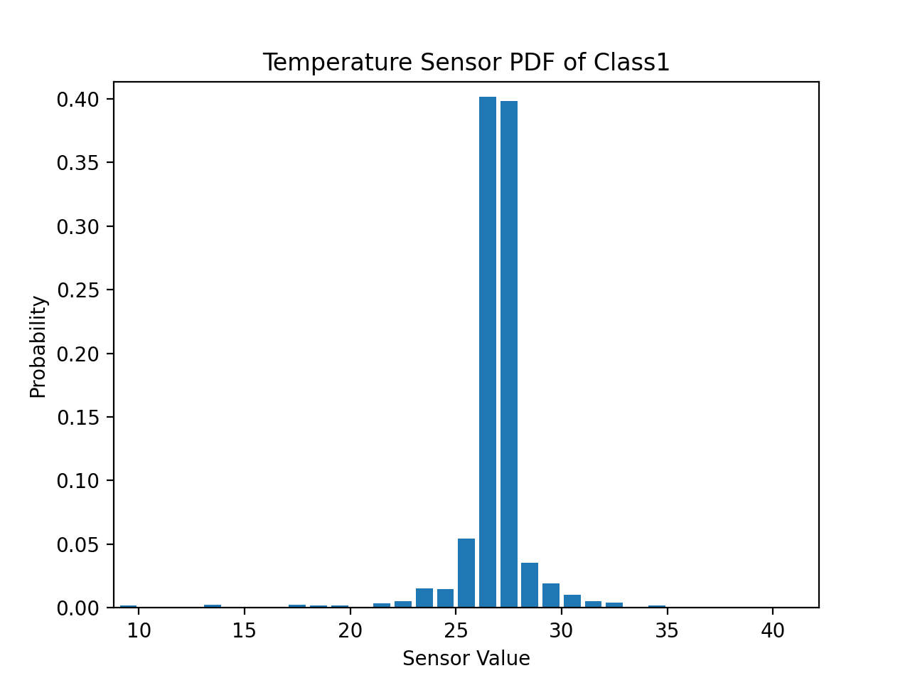
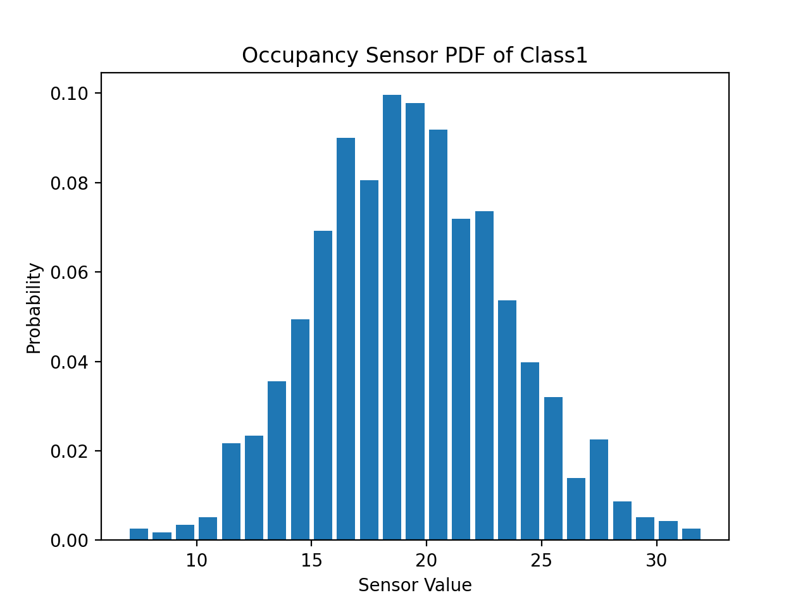
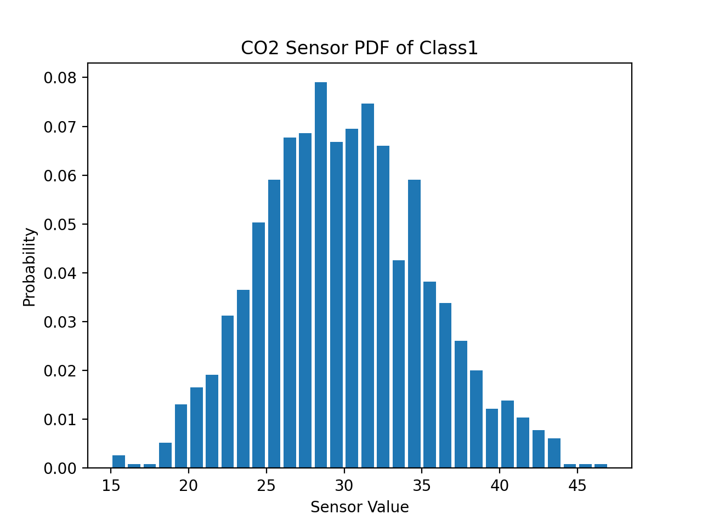
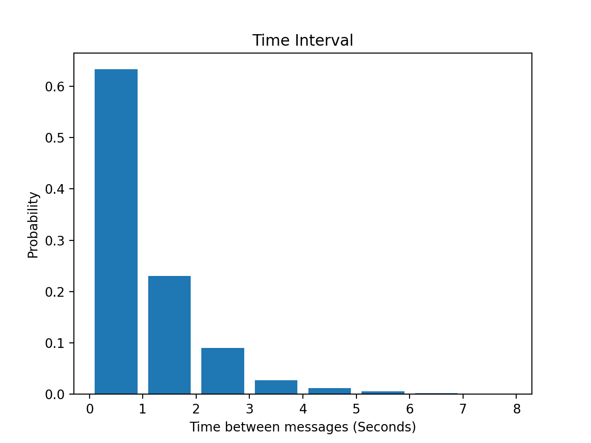

# Sensor Mini Project

Authors: Sean Nemtzow and Austin Negron

Date: 2020-09-09
-----

## Summary
This project focuses on the integration and analysis of internet-based sensors. It serves as an introduction to Python, web-based data transfer, and simple data analysis.  
To simulate the sensors, a server and its clients are locally-hosted. The server maintains the client connections and the clients output the received timestamped messages about the occupancy, temperature, and CO2 level of rooms in a building.

## Task 0
The client outputs json-formatted messages like the following:  
`{"class1": {"time": "2020-09-09T16:24:40.498528", "temperature": [26.991743538688336], "occupancy": [19], "co2": [28.24985548185597]}}` 

The server issues the following greeting string to the client when intially connected:
`ECE Senior Capstone IoT simulator`

#Task 1

#Task 2

A key part of the sensor anaylyzer is finding the basic statistics to then be able to provide a baseline for analomy detection. 

The following statistics are for classroom 1:

Temp Var = 58.65
Temp Median = 26.99

Occupancy Variance = 17.37
Occupancy Median = 19.00

Time Interval Mean = 0.58
Time Interval Variance = 0.94

These probability distribution functions are calculated by plotting a histogram of the data and normalizing so that the data sums to 100%. We were able to accomplish this by calling the Numpy functions and learning how to not take the nan values into account.

#Task 3

a We determined an "anomoly" to be any data point that is 1.5 standard deviation or more from the mean. 

Using this guideline, we found that 1.99% of the data was consiered to be an anomaly. 

After filtering the data, we realized the new median was 26.99, relatively the same as our previous median. However, the new variance was 2.38, quite the difference from our original variance of 58.65.

b No, a persistent change in temperaure doesn't always indicate a failed sensor because the room could be heating or cooling. However, we do expect the data to follow a similar distribution.

c Possible bounds of temperature for each room type include:

	Lab 1: Mininmum value is 17.67 and maximum value is 24.40.

	Classroom 1: Mininmum value is 15.61 and maximum value is 38.59.

	Office: Mininmum value is 9.28 and maximum value is 37.0.

#Task 4

-----
